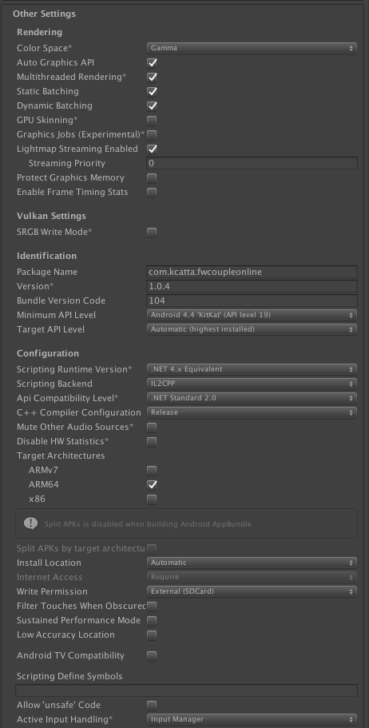
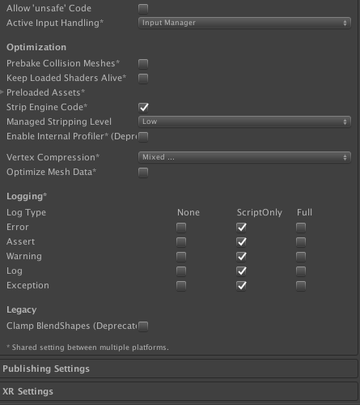

#Note:
#Android
Trên Android 12 thì cần chọn Write Permission là External (SDCard)

#IOS

Đối với IOS build ra một folder khác rồi copy Libraries,Classes,Data vào

##Configuration One Sinal
- https://documentation.onesignal.com/docs/ios-sdk-setup
