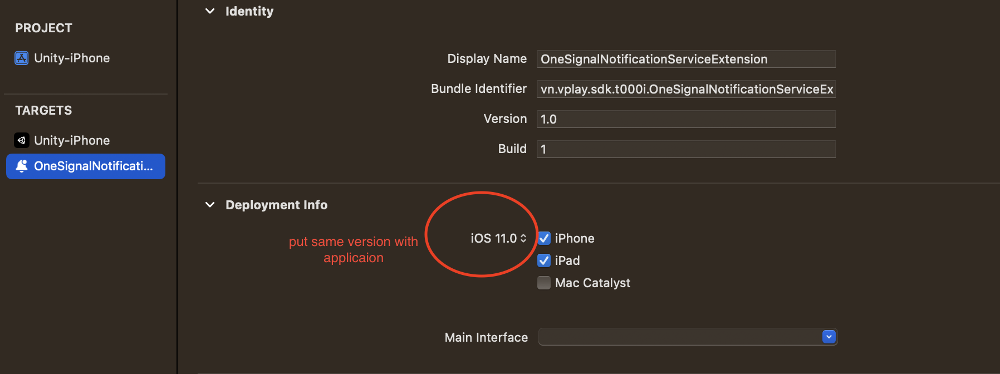

# Note:
# Android
Trên Android 12 thì cần chọn Write Permission là External (SDCard)

# IOS

Đối với IOS build ra một folder khác rồi copy Libraries,Classes,Data vào

## Configuration One Sinal
- https://documentation.onesignal.com/docs/ios-sdk-setup
 
Khi add Notification Extension nhớ để lại Deployment Version
